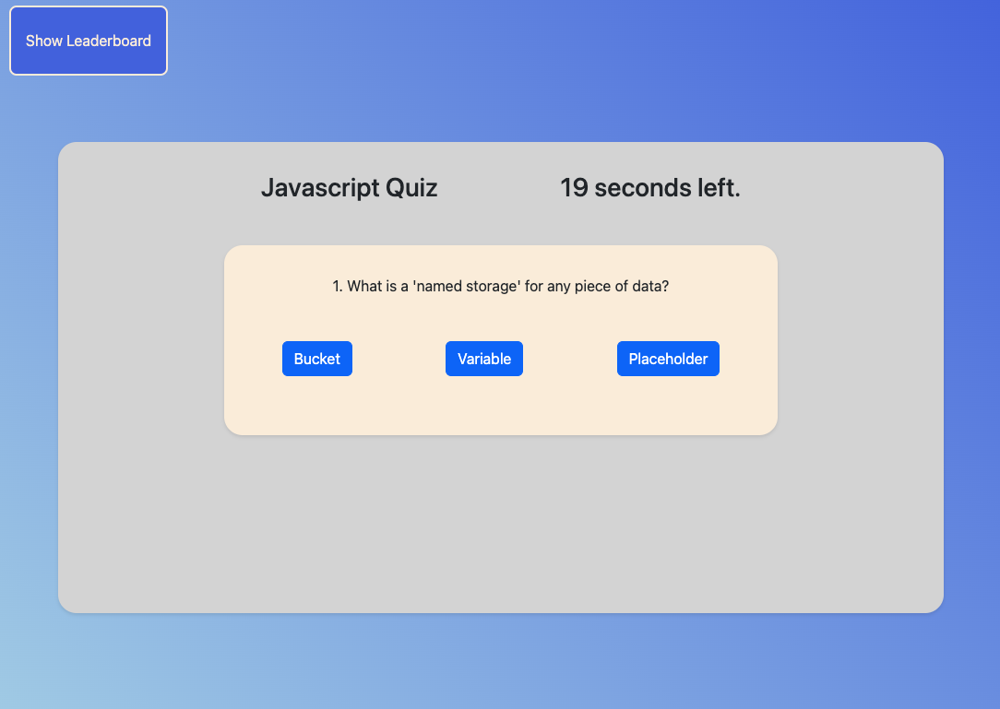

# timedQuiz-JS-04

Test your knowledge of Javascript with this brief quiz.

## Usage

This is a simple timed multiple choice quiz with answers verified, time deducted for wrong answers and user score and initials displayed on a leaderboard - using HTML, CSS and JS.

## User Story

```text
AS A coding boot camp student
I WANT to take a timed quiz on JavaScript fundamentals that stores high scores
SO THAT I can gauge my progress compared to my peers
```

## Acceptance Criteria

```text
GIVEN I am taking a code quiz
WHEN I click the start button
THEN a timer starts and I am presented with a question
WHEN I answer a question
THEN I am presented with another question
WHEN I answer a question incorrectly
THEN time is subtracted from the clock
WHEN all questions are answered or the timer reaches 0
THEN the game is over
WHEN the game is over
THEN I can save my initials and my score
```

## Mock-up

Here is an image showing the appearance of the application:



* [See the live application here](https://cookingmeister.github.io/timedQuiz-JS-04/).

## Credits

MDN Web Docs, W3Schools, and freeCodeAcademy were invaluable assets in completing this exercise, especially for the leaderboard section.

## License

Please see attached license file.
